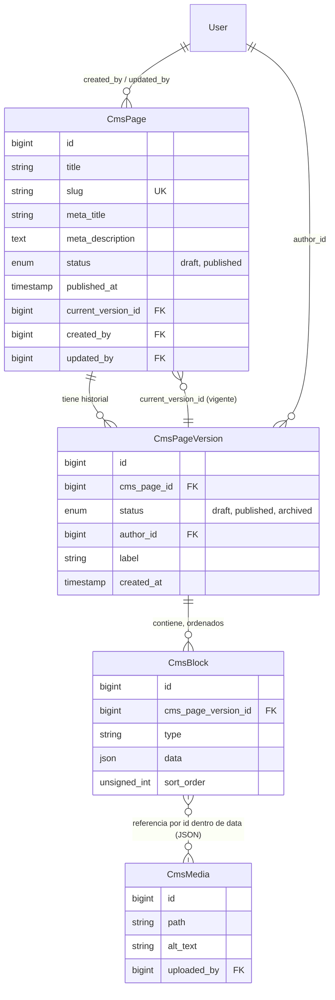
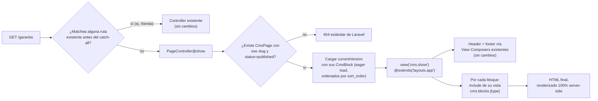

# Cyrex Store — Propuesta de arquitectura: CMS visual de páginas

> **Estado de este documento**: propuesta de diseño, sin código, sin implementar. Fuente de verdad del estado actual del proyecto: [`ARCHITECTURE.md`](ARCHITECTURE.md) (léase antes que este documento si no se tiene fresco). Este documento asume y referencia ese estado constantemente — cada vez que dice "hoy el proyecto ya hace X", es una referencia directa a algo documentado ahí, no una suposición nueva.

---

> **Nota de implementación (posterior a este documento)**: la infraestructura base ya fue creada en el código siguiendo este diseño, con dos ajustes menores respecto a lo escrito abajo: (1) los modelos/tablas se llaman `Page`/`PageBlock`/`Template`/`Media`/`Menu`/`MenuItem` (sin el prefijo `Cms`, por consistencia con el resto del proyecto que no prefija ningún modelo), y (2) no se creó un modelo `GlobalSetting` nuevo — las configuraciones globales del CMS reutilizan el `Setting` ya existente (`ARCHITECTURE.md` sección 5), evitando duplicar un sistema que ya funciona. También se simplificó el versionado (ver sección 13) — no existe todavía `CmsPageVersion`, los bloques cuelgan directo de `Page`. El resto del diseño (bloques tipados, coexistencia, renderizado, editor visual) sigue vigente tal como está descrito.

## 0. Resumen ejecutivo

Se propone un **CMS basado en páginas compuestas por bloques tipados**, no un editor de HTML libre ni un page-builder genérico tipo Elementor/Webflow. Cada página administrable es una secuencia ordenada de bloques; cada bloque es una instancia de un **tipo fijo, definido por desarrollo** (Hero, Texto libre, Galería, FAQ, CTA de WhatsApp, etc.), con datos estructurados (JSON) que rellenan una plantilla Blade ya alineada al sistema visual existente.

Esta decisión — tipos de bloque cerrados en vez de HTML libre — es la piedra angular de toda la propuesta y responde directamente a dos restricciones explícitas: *"mantener el diseño visual existente"* y *"evitar romper el código existente"*. Un editor de HTML libre es exactamente el mecanismo que ya rompió el sitio anterior (documentado en `VISION.md`: *"imágenes promocionales pegadas sobre fotos de producto, colores fuera de paleta"*). No se va a repetir ese error.

El CMS **convive** con el sistema actual sin tocarlo: es 100% aditivo (tablas nuevas, un controller nuevo, una ruta catch-all al final de `routes/web.php`), reutiliza el layout público existente (`layouts/app.blade.php`) y por lo tanto hereda header y footer automáticamente vía los View Composers ya existentes (sección 8/9 de `ARCHITECTURE.md`) sin que se les toque una sola línea. Reutiliza también el patrón de almacenamiento de archivos ya resuelto (disco externo al árbol de deploy, sección 12 de `ARCHITECTURE.md`) en vez de reinventar dónde guardar imágenes.

**Alcance deliberadamente excluido de esta propuesta**: `home.blade.php`, `shop.blade.php` y `product.blade.php` **no se migran al CMS**. Son páginas de catálogo con lógica de negocio real (categorías, productos, precios, carrito) — forzarlas a un modelo de bloques genérico sería sobre-ingeniería, va en contra de la filosofía "menos es más" de `VISION.md`, y multiplica el riesgo de romper algo que hoy funciona. El CMS resuelve el hueco que **sí** está identificado y documentado como pendiente en `ARCHITECTURE.md` (secciones 7, 16 y 17): la ausencia total de un sistema para páginas de contenido tipo "Nosotros", "Garantía", políticas de envío, etc. Al final de este documento (sección 12) se propone, como fase opcional y posterior, cómo extender el mismo mecanismo a *fragmentos* puntuales de páginas existentes (ej. el texto del hero de home) sin migrar la página entera.

---

## 1. Arquitectura completa del CMS

### 1.1 Concepto central: página = versión = lista ordenada de bloques

```
CmsPage (la página, identidad estable: slug, estado, SEO)
   └── tiene muchas CmsPageVersion (historial completo, inmutable, append-only)
          └── la versión vigente (current_version_id) es la que el sitio público renderiza
          └── cada CmsPageVersion tiene muchos CmsBlock, ordenados
                 └── cada CmsBlock tiene un `type` (de un catálogo fijo) + `data` (JSON)
```

Esta separación en tres niveles (Página → Versión → Bloques) es lo que permite versionado real y publicación atómica sin necesidad de lógica de "deshacer cambios campo por campo" — ver sección 8.

### 1.2 Dónde vive cada pieza en el proyecto

Siguiendo la convención YA establecida en el proyecto (modelos flat en `App\Models`, sin subnamespacing — ver `Category`, `Product`, `Setting`; tablas en inglés, rutas/UI en español — ver `categories`/`/admin/categorias`), el CMS se integra así:

| Pieza | Ubicación propuesta | Convención que sigue |
|---|---|---|
| Modelos | `App\Models\CmsPage`, `CmsPageVersion`, `CmsBlock`, `CmsMedia` | Flat, sin subcarpeta `Cms\`, igual que el resto |
| Controller público | `App\Http\Controllers\PageController` | Igual patrón que `HomeController`/`ShopController` |
| Controllers admin | `App\Http\Controllers\Admin\PageController`, `Admin\PageBlockController` | Igual patrón que `Admin\ProductController`/`Admin\CategoryController` |
| Rutas públicas | catch-all al final de `routes/web.php` | — |
| Rutas admin | `Route::prefix('admin')->name('admin.')` → grupo `paginas.*` | Igual que `productos.*`/`categorias.*` |
| Vistas públicas | `resources/views/cms/show.blade.php` + `resources/views/cms/blocks/{type}.blade.php` | `@extends('layouts.app')`, igual que toda vista pública |
| Vistas admin | `resources/views/admin/pages/index.blade.php`, `form.blade.php` (editor) | `@extends('admin.layout')`, igual que `admin/categories/*` |
| Registro de tipos de bloque | `config/cms_blocks.php` (nuevo archivo de config) | Igual espíritu que cualquier `config/*.php` de Laravel — no es contenido editable por el admin, es código |
| Migraciones | `database/migrations/xxxx_create_cms_*.php` | Igual convención de timestamp que las existentes |

### 1.3 Diagrama de entidades



Nótese que `CmsBlock` **no tiene una foreign key formal hacia `CmsMedia`** — la relación es una referencia por id *dentro* del JSON `data` (ej. un bloque de tipo `hero` guarda `{"image_id": 42, ...}`; un bloque de tipo `galeria` guarda `{"image_ids": [12, 15, 9]}`). Una FK relacional única no alcanzaría para bloques que referencian múltiples imágenes (galería), y una tabla pivote formal (`cms_block_media`) sería complejidad innecesaria para el volumen de datos esperado. Es una decisión deliberada de simplicidad, no un descuido.

---

## 2. Cómo convivirá con el sistema actual

Cuatro mecanismos concretos de coexistencia, cada uno diseñado para que el sistema actual **no note que el CMS existe**:

### 2.1 Ruta catch-all al final, nunca antes

`routes/web.php` de hoy resuelve rutas en el orden en que están escritas (comportamiento estándar de Laravel: la primera que matchea gana). La ruta del CMS se agrega como la **última** línea del archivo:

```
Route::get('/{slug}', [PageController::class, 'show'])->name('page.show')->where('slug', '.*');
```

Como `/`, `/tienda`, `/producto/{slug}`, `/buscar-sugerencias`, `/carrito/*` y todo el grupo `/admin/*` ya están declarados ANTES, ninguno de ellos puede ser interceptado por el catch-all — Laravel nunca llega a evaluarlo para esas URLs porque ya encontró una coincidencia más específica antes. Esto es un mecanismo estructural, no una convención de buenas intenciones: es imposible que el catch-all rompa una ruta existente mientras se declare al final, algo que se puede verificar con `php artisan route:list` en cualquier momento.

Como salvaguarda adicional (defensa en profundidad, no estrictamente necesaria pero barata): al crear/editar una página en el admin, se valida que el slug no coincida con una lista corta de segmentos reservados (`admin`, `tienda`, `producto`, `carrito`, `buscar-sugerencias`) para que un admin no pueda crear por error una página con un slug que jamás se serviría igual (quedaría "fantasma" — existiría en la base de datos pero cualquier visita a esa URL seguiría cayendo en la ruta real existente, no en el CMS, generando confusión).

### 2.2 Mismo layout, mismo header, mismo footer — cero duplicación

Toda página CMS extiende `layouts.app` exactamente igual que `home.blade.php`/`shop.blade.php`/`product.blade.php` hoy. Esto significa que **hereda automáticamente** los dos View Composers ya registrados en `AppServiceProvider::boot()` (el de `partials.nav` y el de `layouts.app` mismo) — categorías reales del menú, carrito, WhatsApp, logo configurable, footer con categorías reales. No hace falta escribir NINGÚN código nuevo de header/footer para que una página CMS se vea idéntica al resto del sitio. Este es probablemente el mayor ahorro de esfuerzo de toda la propuesta, y depende enteramente de que la arquitectura de composers documentada en `ARCHITECTURE.md` sección 8 se haya entendido correctamente antes de diseñar esto.

**Único agregado necesario a ese composer existente** (decisión resuelta en sección 13): el composer de `layouts.app` suma una consulta más, análoga a la que ya hace para `footerCategories` — `CmsPage::where('show_in_footer', true)->where('status','published')->orderBy('footer_sort_order')->get()` — para que el footer pueda listar automáticamente las páginas CMS marcadas para aparecer ahí, sin que ninguna página nueva necesite tocar el footer a mano.

### 2.3 Mismo panel admin, mismo layout, mismo sistema de estilos

El admin del CMS (`/admin/paginas`) se agrega como una sección más del sidebar existente en `admin/layout.blade.php` (junto a Productos, Categorías, Usuarios, Ajustes), reutilizando `admin.css` tal cual — mismas clases `.form-section`, `.form-group`, `.admin-table`, `.btn-primary`, etc. Cero CSS nuevo necesario para el andamiaje del CRUD de páginas; el único CSS nuevo posible sería específico del editor de bloques (ver sección 7) y de los propios bloques públicos.

### 2.4 Mismo disco de almacenamiento de imágenes, mismo patrón ya resuelto

`ARCHITECTURE.md` (secciones 12, 17, 23) documenta un incidente real: el deploy automático de Hostinger borraba imágenes de producto subidas al admin porque vivían dentro de la carpeta que Git resetea en cada push. La solución fue un disco (`uploads`) con `root` configurable por variable de entorno apuntando FUERA del árbol de despliegue, servido vía la función nativa `serve: true` de discos locales de Laravel.

El CMS **reutiliza exactamente ese mismo disco** para las imágenes que se suban desde bloques de tipo galería/hero/imagen-texto — no se crea un disco nuevo, no se reinventa el problema. Esto está documentado explícitamente como una de las "decisiones técnicas importantes" que cualquier IA debe conocer (`ARCHITECTURE.md` sección 23, punto 9), y esta propuesta lo respeta al pie de la letra.

---

## 3. Tablas nuevas necesarias

Cuatro tablas, todas aditivas (ninguna modifica `categories`, `products`, `product_variants`, `exchange_rates`, `settings`, `users`).

### `cms_pages`

| Columna | Tipo | Notas |
|---|---|---|
| `id` | bigint, PK | |
| `title` | string | Label interno + fallback de `<h1>`/`<title>` |
| `slug` | string, unique | Segmento de URL, sin slash inicial (ej. `"garantia"`) |
| `meta_title` | string, nullable | Override de SEO; si es null, cae a `title` |
| `meta_description` | text, nullable | SEO — ver sección 11 |
| `status` | enum(`draft`,`published`) | Estado general de la página (independiente del estado de cada versión — ver nota abajo) |
| `published_at` | timestamp, nullable | Cuándo se publicó por primera vez |
| `current_version_id` | bigint, FK nullable → `cms_page_versions.id` | La versión que el público ve AHORA MISMO |
| `show_in_footer` | boolean, default false | Decisión resuelta (ver sección 13): si está activo, la página aparece automáticamente en la columna del footer sin tocar código |
| `footer_sort_order` | unsigned int, nullable | Orden entre las páginas con `show_in_footer=true`; mismo criterio que `categories.sort_order` ya existente |
| `created_by` / `updated_by` | bigint, FK nullable → `users.id` | Auditoría ligera, mismo espíritu que timestamps ya usados en el proyecto |
| `created_at`, `updated_at` | timestamps | |

*Nota sobre `status` duplicado (aquí y en `cms_page_versions`)*: el `status` de `cms_pages` responde "¿esta página existe públicamente en absoluto?" (permite despublicar una página completa sin borrar su historial), mientras que el `status` de cada versión responde "¿esta versión específica es la publicada, un borrador, o una archivada?". Son preguntas distintas y por eso son columnas distintas — no es redundancia accidental.

### `cms_page_versions`

| Columna | Tipo | Notas |
|---|---|---|
| `id` | bigint, PK | |
| `cms_page_id` | bigint, FK → `cms_pages.id` | |
| `status` | enum(`draft`,`published`,`archived`) | Solo una versión por página puede estar en `published` a la vez (se refuerza a nivel de aplicación, no de constraint SQL — igual criterio que usa hoy `CategoryController` para sus reglas de jerarquía, que también son de aplicación y no de base de datos) |
| `author_id` | bigint, FK nullable → `users.id` | Quién generó esta versión |
| `label` | string, nullable | Nota humana opcional (ej. "cambios previos a promo de verano") |
| `created_at` | timestamp | **Sin `updated_at`** — una versión, una vez creada, es inmutable (ver sección 8) |

**Precedente directo en el propio proyecto**: esta tabla sigue exactamente el mismo patrón *append-only* que `exchange_rates` (`ARCHITECTURE.md` sección 5) — nunca se edita una fila existente, siempre se inserta una nueva y se cambia a qué fila apunta el puntero "vigente" (`current_version_id` en `cms_pages`, análogo a cómo `ExchangeRate::current()` simplemente lee la fila más reciente). No es un patrón importado de afuera, es consistencia con una decisión que el proyecto ya tomó por su cuenta para otro problema con la misma forma.

### `cms_blocks`

| Columna | Tipo | Notas |
|---|---|---|
| `id` | bigint, PK | |
| `cms_page_version_id` | bigint, FK → `cms_page_versions.id` | |
| `type` | string | Debe existir como clave en el registro de tipos (`config/cms_blocks.php`) — validado en el admin, no a nivel de base de datos |
| `data` | json | Los campos de este bloque, según el schema de su `type` |
| `sort_order` | unsigned int | Orden de aparición dentro de la página |
| `created_at`, `updated_at` | timestamps | |

### `cms_media` (propuesta, ver nota de alcance en sección 9)

| Columna | Tipo | Notas |
|---|---|---|
| `id` | bigint, PK | |
| `path` | string | Ruta relativa dentro del disco `uploads` (mismo disco que usa `Product::image`) |
| `alt_text` | string, nullable | Accesibilidad + SEO de imagen |
| `uploaded_by` | bigint, FK nullable → `users.id` | |
| `created_at`, `updated_at` | timestamps | |

---

## 4. Modelos

Todos flat en `App\Models`, sin subnamespacing (consistencia con `Category`/`Product`/`Setting` existentes).

- **`CmsPage`**
  - `hasMany(CmsPageVersion::class)`
  - `belongsTo(CmsPageVersion::class, 'current_version_id')` — para acceder a la versión vigente como `$page->currentVersion`
  - `belongsTo(User::class, 'created_by')`, `belongsTo(User::class, 'updated_by')`
  - Scope propuesto `scopePublished($query)` — análogo a `Category::scopeParents()` ya existente, mismo estilo de nombrar scopes cortos y descriptivos.

- **`CmsPageVersion`**
  - `belongsTo(CmsPage::class)`
  - `hasMany(CmsBlock::class)->orderBy('sort_order')`
  - `belongsTo(User::class, 'author_id')`

- **`CmsBlock`**
  - `belongsTo(CmsPageVersion::class)`
  - `$casts = ['data' => 'array']` — mismo patrón exacto que `Product::$casts` ya usa para `specs` (`ARCHITECTURE.md` sección 5) — otro punto de consistencia directa con código existente, no una técnica nueva introducida por el CMS.
  - Método de utilidad conceptual (sin implementar aún): resolver el nombre de la vista Blade correspondiente a su `type` (`"cms.blocks.{$this->type}"`), y fusionar `data` con los valores default del schema de ese tipo (protege contra errores si el schema de un tipo de bloque cambia después de que ya existan bloques guardados con el schema viejo — ver sección 10).

- **`CmsMedia`**
  - Sin relaciones Eloquent formales hacia `CmsBlock` (ver sección 1.3, la referencia vive dentro del JSON). Accessor conceptual `url` que arma la URL pública igual que `Product::getImageUrlAttribute()` ya hace hoy — mismo patrón, mismo disco.

## 5. Relaciones (resumen)

```
CmsPage 1───N CmsPageVersion            (historial completo, inmutable)
CmsPage 1───1 CmsPageVersion            (la vigente, vía current_version_id — puntero explícito,
                                          mismo espíritu que Setting::get() cacheado: evitar
                                          recalcular "cuál es la actual" en cada request)
CmsPageVersion 1───N CmsBlock            (ordenados por sort_order)
CmsBlock N┄┄┄N CmsMedia                  (referencia lógica por id dentro de `data`, no FK formal)
User 1───N CmsPageVersion                (autoría)
User 1───N CmsPage                       (created_by / updated_by)
```

---

## 6. Cómo funcionarán los bloques

### 6.1 El catálogo de tipos es fijo y lo define desarrollo, no el admin

Esta es la decisión de diseño más importante de todo el documento, así que se justifica en detalle:

Un CMS de bloques puede diseñarse de dos formas fundamentalmente distintas:

1. **Bloques como HTML/CSS libre** (el admin escribe o pega contenido con formato arbitrario) — esto es lo que la mayoría de la gente imagina cuando piensa en "editor visual", pero es exactamente el patrón que ya rompió el sitio anterior de Cyrex (`VISION.md`: colores fuera de paleta, imágenes promocionales pegadas sobre fotos de producto). Requeriría además un sanitizador de HTML robusto para evitar XSS, y no hay ninguna garantía de que el resultado respete la tipografía de tres roles (Space Grotesk/Inter/JetBrains Mono) ni la paleta negro/dorado que son la identidad visual documentada del proyecto.
2. **Bloques como tipos predefinidos con datos estructurados** (lo que se propone acá) — el admin llena campos (título, texto, imagen, link), y es SIEMPRE una plantilla Blade ya escrita por desarrollo la que decide cómo se ve eso. El admin no puede, aunque quiera, poner un color fuera de paleta o una fuente distinta, porque nunca tiene acceso a esas propiedades — el "editor visual" edita CONTENIDO, no DISEÑO.

Se elige la opción 2 sin ambigüedad. Es la única que cumple simultáneamente "mantener el diseño visual existente" y "editor visual" sin contradicción — y es coherente con una restricción que el proyecto YA se auto-impone en otro punto del admin: el selector de ícono de categorías (`ARCHITECTURE.md` sección 6) ofrece solo 3 opciones hardcodeadas (`i-cpu`/`i-mouse`/`i-chair`), nunca un selector de ícono libre o un upload de SVG arbitrario. El CMS de bloques extiende ese mismo principio (opciones curadas, no libertad total) a una escala mayor.

### 6.2 Anatomía de un tipo de bloque

Cada tipo de bloque, definido en `config/cms_blocks.php`, tiene tres partes:

1. **Un `type` key** (string, ej. `hero_simple`, `texto_libre`, `imagen_texto`, `galeria`, `faq_acordeon`, `cta_whatsapp`, `specs_tabla`).
2. **Un schema de campos** — declara qué campos tiene ese tipo y de qué naturaleza (texto corto, texto largo, rich-text restringido, referencia a imagen, URL, repetidor de sub-campos). Este schema sirve para DOS cosas al mismo tiempo: generar el formulario de edición en el admin (sección 7) y validar los datos antes de guardar.
3. **Una plantilla Blade pública** (`resources/views/cms/blocks/{type}.blade.php`) que recibe los datos ya resueltos (imágenes convertidas a URL, etc.) y produce el HTML final, usando las clases CSS existentes del proyecto (`.wrap`, tokens de color vía variables CSS, tipografía `--font-display`/`--font-mono` donde corresponda).

### 6.3 Catálogo inicial de tipos propuesto

Elegidos porque resuelven necesidades YA documentadas como huecos pendientes en `ARCHITECTURE.md` (sección 16), no como una lista especulativa:

| Tipo | Para qué sirve | Precedente visual que reutiliza |
|---|---|---|
| `hero_simple` | Título + subtítulo + imagen de fondo opcional + botón CTA — para el tope de una página tipo "Nosotros" | Mismo lenguaje visual que el hero de `home.blade.php` (tipografía grande, `--gold` en énfasis) |
| `texto_libre` | Bloque de texto con formato mínimo (negrita, cursiva, listas, links) | — |
| `imagen_texto` | Imagen a un lado, texto al otro (alternable) | El patrón "producto como experiencia" que `VISION.md` cita de referencia (apple.com/airpods-pro) |
| `galeria` | Grid de imágenes | Reutiliza `.product-grid`/`.card-media` como base de estilo |
| `faq_acordeon` | Preguntas/respuestas expandibles — ideal para una página de Garantía con términos | Reutiliza el mecanismo de `x-collapse` ya implementado para el acordeón de categorías del drawer mobile (`ARCHITECTURE.md` sección 3) — mismo comportamiento de apertura/cierre, coherencia de interacción en todo el sitio |
| `cta_whatsapp` | Botón de WhatsApp con texto custom | Reutiliza literalmente las clases `.footer-whatsapp-btn`/`.nav-whatsapp-btn` ya existentes |
| `specs_tabla` | Tabla de datos clave-valor | Reutiliza `.spec-table`, el mismo componente visual que ya usa `product.blade.php` para especificaciones técnicas |
| `numeros_destacados` | Grid de estadísticas (número + etiqueta), ej. "3 sucursales" / "1200+ productos" / "X años" | Decisión resuelta en sección 13: `VISION.md` documenta que este tipo de dato se sacó deliberadamente del hero de home ("información de catálogo, no de experiencia"), pero es exactamente el contenido que sí pertenece a una página Nosotros |

Este catálogo es intencionalmente corto para una v1. Agregar un tipo nuevo es un cambio de código (nuevo archivo Blade + entrada en el config), nunca una acción del admin — y eso es correcto, no una limitación a resolver después.

---

## 7. Cómo funcionará el editor visual

### 7.1 Restricción de partida: sin SPA, sin framework JS pesado

El admin actual es 100% Blade + Alpine.js servido por request tradicional (`ARCHITECTURE.md` secciones 3 y 6). El editor del CMS debe mantenerse dentro de ese mismo paradigma — nada de React/Vue, nada de un bundler nuevo, nada que contradiga "NO convertir el proyecto en un SPA".

### 7.2 Propuesta: editor de panel dividido, con preview real vía iframe

No un "canvas" donde se arrastra y edita directamente sobre el diseño final (ese patrón, tipo Elementor/Webflow, requiere sincronización compleja entre un DOM editable y el modelo de datos, y típicamente sí empuja hacia una arquitectura tipo SPA). En su lugar:

- **Columna izquierda — lista de bloques**: cada fila muestra el tipo de bloque y un resumen corto de su contenido (ej. las primeras palabras del título). Acciones por fila: Editar, Duplicar, Eliminar. Reordenar por arrastre simple (a definir en implementación si es HTML5 drag nativo o una librería liviana tipo Sortable.js — decisión de implementación, no de arquitectura). Botón "Agregar bloque" que despliega la lista de tipos disponibles (los del catálogo, sección 6.3).
- **Panel de edición**: al elegir "Editar" sobre un bloque, se despliega inline (expandiéndose en el mismo panel, sin modal ni navegación de página nueva) un formulario generado a partir del schema de ese tipo — mismas clases `.form-group`/`.form-section` que ya usa todo el admin (`ARCHITECTURE.md` sección 6), cero CSS nuevo para el andamiaje del formulario.
- **Columna derecha — previsualización real**: un `<iframe>` apuntando a una ruta de preview (`/admin/paginas/{page}/preview`, protegida por el middleware `auth` existente) que renderiza la página usando el MISMO controller y las MISMAS plantillas Blade que el público (`cms/show.blade.php`), pero contra la versión `draft` en edición en vez de la `published`. Esto garantiza WYSIWYG real (lo que se ve en el iframe es literalmente el sitio real, no una aproximación construida aparte en JavaScript) sin necesidad de mantener un "motor de preview" paralelo.
- **Guardado**: cada edición de bloque se envía al servidor (mismo patrón dual JSON/redirect que `CartController` ya usa hoy — `ARCHITECTURE.md` sección 4) y actualiza los bloques de la versión `draft` en curso. Tras guardar, el iframe se recarga para reflejar el cambio.
- Para v1 se recomienda **guardado explícito por bloque** (botón "Guardar" dentro del panel de edición de cada bloque) en vez de autosave continuo — es más simple de implementar y razonar, y el modelo de versiones ya protege contra pérdida de trabajo grave (nada se pierde hasta que se recarga la página sin guardar, igual que cualquier formulario HTML tradicional). Autosave incremental queda como mejora de fase posterior si se valida que hace falta.

### 7.3 Por qué este enfoque y no un "constructor visual" con drag-and-drop directo sobre el diseño

Un constructor que permita arrastrar bloques directamente sobre una representación visual completa de la página (en vez de una lista) es más vistoso, pero: (a) requiere renderizar la página completa dentro de un contexto editable, lo cual complica enormemente mantener la separación "el admin edita contenido, no diseño"; (b) es sustancialmente más trabajo de implementación; (c) empuja hacia necesitar JavaScript más sofisticado, arriesgando la restricción de "no SPA". La propuesta de panel dividido (lista + iframe de preview real) logra el 90% del valor percibido de "editor visual" (ver cambios reflejados de inmediato, en el diseño real) con una fracción del riesgo y la complejidad.

---

## 8. Cómo funcionará el versionado de páginas

1. **Edición** = trabajar sobre una `CmsPageVersion` en estado `draft`. Si la página no tiene ningún draft abierto, se crea uno nuevo copiando los bloques de la versión `published` actual (copy-on-write) — así el admin siempre parte de "lo que ya está publicado" y no de cero.
2. **Una versión publicada nunca se edita en el lugar.** Cualquier cambio, por chico que sea, ocurre sobre la versión `draft`. Esto es lo que garantiza que el sitio en vivo nunca puede quedar en un estado a medio-editar — un error mientras se trabaja en un draft es, por definición, invisible para el público hasta que alguien decida publicarlo.
3. **Publicar** es una operación atómica (transacción de base de datos) con tres pasos:
   - la versión `draft` en curso pasa a estado `published`;
   - la versión que ANTES era `published` (si existía) pasa a `archived` — nunca se borra;
   - `cms_pages.current_version_id` se actualiza para apuntar a la nueva versión publicada.
4. **El sitio público siempre lee `current_version_id`**, nunca "la versión más reciente por fecha" — esto es lo que permite tener un draft en progreso indefinidamente sin que afecte lo que el público ve.
5. **Rollback** = re-apuntar `current_version_id` a una versión `archived` anterior (y volver a marcarla `published`, archivando la que estaba vigente). No hace falta ninguna lógica de "deshacer campo por campo": como las versiones son snapshots completos e inmutables, volver atrás es un cambio de puntero, no una operación de reconciliación de datos.
6. **Historial visible en el admin**: listado de versiones de una página (fecha, autor, nota opcional), cada una accesible en modo solo-lectura vía la misma ruta de preview usada durante edición — permite comparar antes de decidir un rollback.

Este modelo es deliberadamente el mismo patrón append-only + puntero-a-vigente que el proyecto ya usa para `exchange_rates`/`ExchangeRate::current()` — no una técnica nueva.

---

## 9. Cómo se almacenará el contenido

**Nunca como HTML de página completo.** Se almacenan DATOS estructurados (`cms_blocks.data`, JSON), tipados por el schema de cada tipo de bloque, y el HTML se genera siempre en el momento de renderizar, a partir de la plantilla Blade correspondiente a ese tipo. Esto tiene una consecuencia importante para el futuro: si algún día se decide rediseñar visualmente, por ejemplo, cómo se ven todos los bloques `hero_simple` del sitio, se edita UN archivo Blade y el cambio se refleja instantáneamente en todas las páginas que usan ese tipo — no hay que ir página por página editando HTML pegado, que es exactamente el problema estructural que tienen los editores de HTML libre.

Las imágenes referenciadas por los bloques se suben al disco `uploads` ya existente (mismo mecanismo que usa `Product::image`, ver sección 2.4), y su metadata (ruta, alt text) vive en `cms_media` — un bloque no guarda una URL cruda dentro de su JSON, guarda un **id de `CmsMedia`**, de forma que el alt text y la gestión de esa imagen quedan centralizados y no duplicados por cada bloque que la use.

**Sobre el alcance de `cms_media` en la v1**: es razonable lanzar la primera versión del CMS SIN una librería de medios reutilizable (cada bloque sube su propia imagen directo, sin pasar por una tabla intermedia) si se prioriza velocidad de entrega — la migración de "imagen cruda en el bloque" a "referencia a `CmsMedia`" es un cambio aislado y de bajo riesgo para hacer después, una vez que se vea si realmente hace falta reutilizar la misma imagen en múltiples bloques/páginas. Se documenta la tabla acá porque es la decisión arquitectónicamente correcta a mediano plazo, no porque sea estrictamente necesaria desde el primer commit.

---

## 10. Cómo funcionará el renderizado

Flujo de una petición pública a una página CMS:



Puntos clave de este flujo:

- **Sin ninguna llamada a datos desde el cliente** — todo el contenido ya está en el HTML cuando llega al navegador. Esto satisface directamente "mantener SEO server-side" y "no convertir en SPA" por construcción, no por disciplina.
- **El dispatcher de bloques es un simple `foreach` + `include` dinámico** por nombre de vista derivado del `type` de cada bloque (ej. el bloque con `type = "hero_simple"` incluye `cms.blocks.hero_simple`). Si un bloque tiene un `type` que no corresponde a ninguna vista existente (por ejemplo, se eliminó un tipo del catálogo pero quedaron bloques viejos de ese tipo en la base de datos), el render de ESE bloque específico se omite silenciosamente (con un log de advertencia) en vez de romper la página completa — aislamiento de fallos a nivel de bloque individual.
- **Meta SEO**: `meta_title`/`meta_description` de `CmsPage` rellenan el `<head>` (con fallback a `title` si están vacíos). Esto es, de hecho, la primera vez que el proyecto tendría meta description en absoluto — hoy ninguna vista la tiene (`ARCHITECTURE.md` sección 13). Es un beneficio colateral del CMS, no su objetivo principal, pero vale la pena señalarlo: si se extiende el mismo patrón de campos `meta_title`/`meta_description` a `Product` en el futuro, se cerraría buena parte del hueco de SEO documentado.

### 10.1 Sobre la resiliencia a cambios de schema

Si el schema de un tipo de bloque cambia (se agrega o quita un campo) después de que ya existan bloques guardados con la forma vieja, el render debe fusionar `data` con los defaults del schema actual en vez de asumir que todas las claves esperadas existen — evita errores de "variable indefinida" en Blade para contenido creado antes del cambio. Esto es una responsabilidad del modelo `CmsBlock` (accessor de datos "seguros"), no de cada plantilla individual repitiendo la misma defensiva.

---

## 11. Cumplimiento explícito de cada restricción pedida

| Restricción pedida | Cómo la satisface esta propuesta |
|---|---|
| Reemplazar páginas Blade estáticas por administrables | `CmsPage`/`CmsPageVersion`/`CmsBlock` + admin CRUD + ruta catch-all — cubre el hueco real (Nosotros/Garantía/etc.), sin migrar catálogo (ver alcance, sección 0) |
| Mantener Laravel como backend | Cero dependencias nuevas de infraestructura (framework, base de datos, hosting) — todo Eloquent + Blade estándar |
| Mantener Blade como motor de renderizado | Cada tipo de bloque es una plantilla Blade; el CMS no introduce Twig, ni un motor de templates alternativo, ni HTML generado por JS en cliente |
| NO convertir en SPA | Renderizado 100% server-side; el editor usa Alpine.js (ya presente en el proyecto) + un iframe de preview real, nunca un bundle de framework de UI |
| Mantener el rendimiento actual | Costo por request: 1 query de página + 1 query con eager load de bloques — comparable a lo que ya hace `HomeController`. Sin JS adicional en el sitio público (los bloques son HTML plano). Cacheable a futuro con el mismo patrón que `Setting::get()` si hiciera falta |
| Mantener SEO server-side | Nada de contenido cargado por fetch/AJAX en el público; `meta_title`/`meta_description` nuevos en `<head>`, primera vez que el proyecto los tiene |
| Mantener el diseño visual existente | Catálogo de tipos de bloque cerrado y curado por desarrollo (sección 6.1) — el admin edita contenido, nunca HTML/CSS/tipografía/color libres |

---

## 12. Fases de implementación propuestas (no pedidas explícitamente, pero necesarias para no romper nada de una sola vez)

**Fase 1 — mínimo viable**: las 3 tablas core (`cms_pages`, `cms_page_versions`, `cms_blocks`), modelos, admin CRUD con editor de panel dividido (sección 7), 5–6 tipos de bloque iniciales (sección 6.3), ruta catch-all, ruta de preview. Suficiente para publicar las páginas ya identificadas como pendientes (Nosotros, Garantía, políticas de envío). Se puede desplegar a producción sin ningún riesgo para el sitio existente incluso antes de crear la primera página real (si `cms_pages` está vacía, el catch-all nunca matchea nada).

**Fase 2 — opcional, tras validar la v1 en uso real**: tabla `cms_media` como librería reusable (en vez de subida directa por bloque), rich-text sanitizado para `texto_libre` (requiere evaluar una librería de sanitización HTML, ej. `mews/purifier`, como dependencia nueva — hoy el proyecto no tiene ninguna), reordenamiento por arrastre en el editor, quizás autosave.

**Fase 3 — opcional, mayor alcance y mayor riesgo, requiere decisión explícita del dueño del proyecto antes de encararse**: extender el mismo mecanismo de bloques a *fragmentos específicos* de páginas existentes que hoy son texto hardcodeado — por ejemplo, que el título/subtítulo del hero de `home.blade.php` sea editable desde un bloque CMS sin migrar el resto de la página (que sigue siendo Blade normal con sus queries de categorías/productos destacados intactas). Esto NO es "migrar home al CMS" — es exponer un slot puntual y acotado. Se menciona como posibilidad futura, no como parte de esta propuesta de v1.

---

## 13. Decisiones resueltas (previamente "preguntas abiertas")

1. **Navegación**: se agrega un campo booleano `show_in_footer` + `footer_sort_order` a la página (no versión, ver nota de simplificación abajo). El footer arma su columna correspondiente automáticamente a partir de las páginas marcadas, sin que ninguna página nueva requiera un cambio de código para aparecer enlazada.
2. **Roles**: se mantiene un solo nivel de acceso (cualquier usuario autenticado = admin total), igual que hoy. No se agregan Policies ni un sistema de permisos en esta fase — se revisita el día que haya un segundo usuario real tocando el CMS.
3. **Catálogo de bloques**: se suma `numeros_destacados` (grid de estadísticas) a los 7 tipos ya propuestos, por la razón documentada en la tabla de la sección 6.3. No se agregan bloques de testimonios/reseñas — no existe ningún sistema de reviews en el proyecto (`ARCHITECTURE.md` sección 16) y sería una feature nueva completa, no un tipo de bloque de contenido.

### Nota de simplificación aplicada durante la implementación de infraestructura

La primera pasada de infraestructura (migraciones/modelos/rutas) implementó `Page` con un campo `status` directo (`draft`/`published`) en vez del modelo completo de tres niveles Página→Versión→Bloques descrito en la sección 1.1 de este documento. Es decir: **por ahora no existe `CmsPageVersion`** — los bloques (`page_blocks`) cuelgan directo de `pages`, sin historial de versiones ni publicación atómica con puntero a versión vigente.

Esto es un recorte de alcance deliberado para la fase de infraestructura, no un abandono del diseño de versionado — sigue siendo la evolución correcta a mediano plazo (sección 8 completa) y se puede agregar después de forma **aditiva**: una tabla `page_versions` nueva, sin romper `pages`/`page_blocks` tal como quedaron. Cuando se llegue a construir el editor visual real (Fase 1 completa, ver sección 12), hay que decidir explícitamente si el versionado se suma antes de lanzar publicación real, o si `status: draft/published` alcanza para el volumen de contenido esperado (páginas institucionales, bajo volumen de cambios) y el versionado se pospone hasta que haga falta de verdad.
